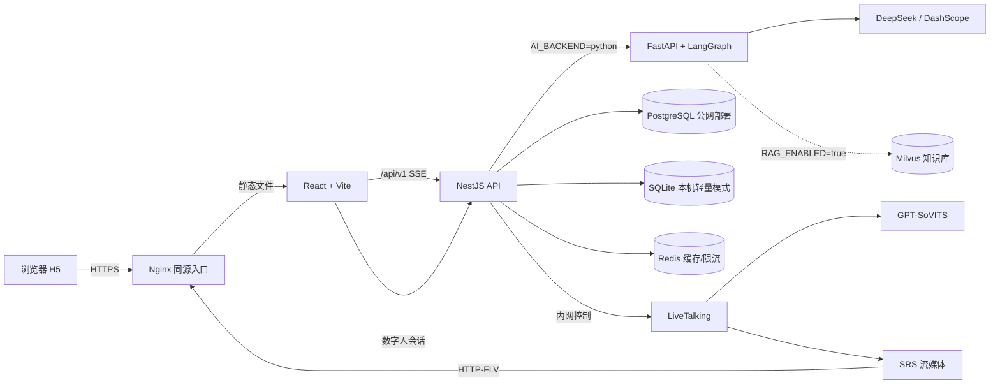

# HealthCompanion 公网 Demo、README 与启动入口设计

状态：待审批
日期：2026-09-29

## 背景

仓库由 React/Vite H5、NestJS API 和 FastAPI/LangGraph AI 服务组成。live 服务器的 H5 与服务进程已经运行，但仓库根目录没有面向参赛者的 README 或本机启动入口。现有 `系统架构图.md` 与线上配置文档基于较早的部署状态，不适合作为当前架构的唯一说明。

公网入口当前通过 HTTP 可访问。服务器本机 443 有 TLS 服务，但使用自签证书；从公网访问 443 超时。`115.190.225.138.nip.io` 当前解析到 live IP。目标 HTTPS 地址为 `https://115.190.225.138.nip.io/`，需先开放云侧 TCP 443，并部署可信且自动续期的证书，才能对外发布。

当前 H5 默认使用固定 `demo_h5_demo_fixed`。NestJS 对所有 `demo_` 前缀 token 都生成对应的用户 ID；聊天与会话会写入数据库。公开站点不能继续让所有访客共用该固定 token。公开构建也不能携带 Xmov App Secret；数字人应使用已有的服务端 LiveTalking/TTS 路径。

## 目标

1. 提供可通过 HTTPS 访问的交互式公网 Demo，访客不会共用同一个演示身份。
2. 在仓库根目录提供中文 README，准确说明如何体验、如何运行、依赖哪些外部服务，以及哪些能力默认关闭或不在仓库内。
3. 提供 Windows PowerShell 一键本机启动入口，启动 H5、NestJS 与 AI 服务；使用 SQLite 轻量模式，不要求本机 Docker、模型权重或 Xmov 凭据。
4. 更新系统架构图，使其区分本机开发链路与公网部署链路，并如实表达 RAG 是可选配置。

## 非目标

- 不在浏览器构建产物中加入 Xmov Secret，也不把 Xmov 作为公网 Demo 的数字人提供方。
- 不把 LiveTalking、GPT-SoVITS、SRS 或模型权重复制进 Git 仓库。
- 不将公网 Demo 描述为可存放真实健康档案的生产服务。
- 不改变已有 PR #4 中的 CI、Xmov/TTS 与 RAG citation 实现范围。
- 不更改云厂商安全组；若 TCP 443 尚未开放，部署说明会明确指出该外部前置条件。

## 方案

### 公网 Demo

- 使用临时主机名 `115.190.225.138.nip.io`，同源反向代理 H5 与 `/api/v1`，避免 HTTP API 被 HTTPS 页面当作混合内容拦截。
- H5 为每个浏览器会话生成高熵随机 `demo_` token 并保存在 `sessionStorage`，移除固定共享 token。服务端继续将 token 确定性映射为独立演示用户。NestJS 当前全局限流设置为每分钟 30 次；部署在反向代理后时，必须核实并正确配置访客 IP 识别，避免所有访客共用代理地址限额。
- 使用服务端 LiveTalking/TTS，不设置 `VITE_XMOV_APP_ID` 或 `VITE_XMOV_APP_SECRET`。公开 H5 也不含 Xmov 开发控制入口。
- 页面和 README 明确提示：这是演示服务，请勿输入真实姓名、电话、病史、用药等资料。后端会保存聊天消息与会话，演示数据并非端到端加密或生产级隐私存储。
- 使用有效 HTTPS 证书；证书自动续期必须配置并验证。当前服务器没有 Certbot，且公网 443 不可达。实施完成前不将候选地址标为可用 Demo。

### Windows 本机一键启动

- 根目录脚本 `start-demo.ps1` 检查 Node.js 与 Python 版本，按需安装 H5/backend npm 依赖和 AI Python 开发依赖，然后启动三个服务并打开 H5。
- H5 使用 `http://localhost:3000/api/v1`；NestJS 使用 `PORT=3000`、`DB_LIGHTWEIGHT=true`、`AI_BACKEND=python` 和 `AI_SERVICE_URL=http://127.0.0.1:8000`；Python AI 服务使用 8000 端口。
- 数据写入 backend 的 SQLite 开发文件。密钥只从本地忽略文件或环境变量读取，不在脚本、README 或提交中放入凭据。
- DeepSeek/DashScope Key 可选；为空时文档说明使用应用现有的降级路径。缺少 LiveTalking/模型权重时，本机显示 H5 已有的数字人回退画面。
- 一键脚本只面向 Windows PowerShell；Linux 用户仍可按 README 中列出的服务命令逐个启动。

### README 与架构图

- 根 `README.md` 使用中文，作为 GitHub 项目入口。
- 包含在线 Demo 状态/链接、主要功能、架构文档链接、Windows 快速开始、可选密钥配置、CI 检查、外部模型运行条件、RAG citation 启用条件及演示数据隐私提示。
- `系统架构图.md` 更新为当前 Mermaid 总览：浏览器/H5、Nginx、NestJS、Python AI、PostgreSQL/SQLite、Redis、可选 Milvus/RAG、服务端 LiveTalking/TTS/SRS 与外部 LLM。图中分别标出公网和本机路径。
- 文档只宣传在当前分支和配置中可验证的行为，不将关闭的 RAG 或缺失的外部模型服务描述为默认可用。

## 架构

本机模式使用 SQLite 和同机 FastAPI；公网模式使用服务器数据库、Nginx 和服务器端数字人服务。Xmov 是单独的本地接入选项，不属于公开 Demo 路径。

## 安全与运行说明

- `demo_` token 只是演示身份隔离手段，不是正式身份认证；匿名接口仍依赖 NestJS 限流并应避免提交真实个人资料。
- 公网聊天文本会到达后端与所配置的 LLM 服务，并保存在后端会话库。README 必须直接写明。
- `VITE_*` 会进入浏览器代码。公网构建严禁设置 Xmov Secret。
- 公网 Demo 发布以从公网验证证书信任、443 可达、H5/API 同源、AI 与数字人链路可用为完成条件。若 443 无法开放，README 不发布伪 HTTPS 链接，并记录待处理项。

## 验收标准

1. README 给出可用的本机启动命令、必要运行版本、配置边界和当前 Demo 状态；没有虚构域名或未启用能力。
2. `start-demo.ps1` 从仓库根目录可启动 H5、NestJS 与 Python AI，Ctrl+C 后可停止启动的本机服务；轻量模式不依赖 PostgreSQL/Redis/Milvus。
3. 两个新的浏览器会话生成不同演示 token，H5 请求不再使用固定 `demo_h5_demo_fixed`；访客能看到勿输入真实健康资料的提示。
4. 公网产物不包含 Xmov 凭据；公网 Demo 的 H5 与 API 均使用 HTTPS 同源地址。
5. 架构图反映当前代码；RAG 标注为配置启用，数字人模型服务标注为仓库外依赖。
6. 公网 443、有效证书、AI 健康检查、数字人访问与 H5/API 交互均完成实际验收后，README 才将链接标为“在线体验”。

## 尚待运行环境验收的条件

- 云安全组对 TCP 443 的公网入站规则。当前公网连接超时。
- 可信证书与自动续期配置。当前服务器只有本地自签证书且未安装 Certbot。
- 现有 TLS 443 监听进程归属与配置路径；必须在部署前确认，避免覆盖非项目服务。
- 公网构建的服务端 API、LiveTalking 与媒体流路由是否与目标 H5 分支一致。
