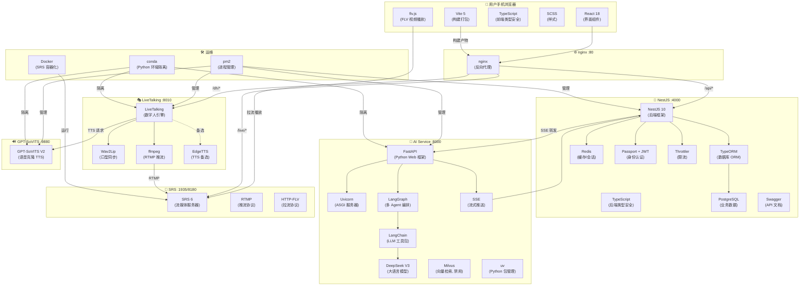

# 炎华众康 · 技术栈大白话解读

> 用最通俗的语言，解释这个项目里用到的每一项技术"是什么"以及"它在这里干什么"。
> 适合没有编程基础的人阅读。

---

## 目录

- [一、先理解：这个项目到底在干什么](#一先理解这个项目到底在干什么)
- [二、前端技术（用户看到的部分）](#二前端技术用户看到的部分)
- [三、后端技术（服务器大脑）](#三后端技术服务器大脑)
- [四、AI 技术（智能大脑）](#四ai-技术智能大脑)
- [五、数字人技术（让 AI 有脸有声音）](#五数字人技术让-ai-有脸有声音)
- [六、流媒体技术（把视频传到用户手机上）](#六流媒体技术把视频传到用户手机上)
- [七、数据存储技术（记东西的地方）](#七数据存储技术记东西的地方)
- [八、基础设施技术（服务器运维工具）](#八基础设施技术服务器运维工具)
- [九、一张图看全部技术栈的协作关系](#九一张图看全部技术栈的协作关系)

---

## 一、先理解：这个项目到底在干什么

想象一下，你要做一个 **"AI 健康顾问"**：

> 用户打开手机上的网页 → 输入"我最近血压高怎么办" → 网页上出现一个**虚拟人**，像真人一样开口回答你的问题，还能流式对话、实时互动。

这个项目就是做这件事的。它由 **5 个独立的程序** 组成，像一个交响乐团，每个程序负责一块，合起来才完整。

| 角色 | 类比 | 本项目中的程序 |
|------|------|--------------|
| 前台接待 | 接待客人、登记信息 | H5 前端（手机上的网页） |
| 业务经理 | 接需求、管流程、记档案 | NestJS 后端 |
| 大脑 | 思考问题、给出答案 | AI Service（LangGraph + DeepSeek） |
| 嘴巴和脸 | 把文字变成声音和视频 | LiveTalking + GPT-SoVITS + Wav2Lip |
| 传输管道 | 把视频从服务器传到手机 | SRS + nginx |

---

## 二、前端技术（用户看到的部分）

### 2.1 React —— 网页的"乐高积木"

- **是什么**：React 是 Facebook 开发的一个 **网页界面库**。你可以把它理解为"乐高积木"——把网页拆成一个个独立的小零件（按钮、输入框、视频播放器），然后拼起来。
- **通俗类比**：传统建网页像砌墙（一层一层写），React 像搭积木（每个积木管自己的事，互相独立）。
- **版本**：React 18
- **本项目中的作用**：用户打开的手机网页（H5）就是用 React 搭出来的。它负责显示聊天界面、接收用户输入、播放数字人视频。

### 2.2 Vite —— 网页的"快速组装台"

- **是什么**：Vite 是一个 **前端构建工具**。React 写出来的代码浏览器看不懂，Vite 负责把它"翻译"成浏览器能跑的格式。
- **通俗类比**：React 是设计图，Vite 是工厂，把设计图变成实物产品。
- **版本**：Vite 5
- **本项目中的作用**：把 React 代码打包成 `dist/` 目录下的文件，然后 nginx 把这些文件发给用户手机。

### 2.3 TypeScript —— 给代码加上"安全气囊"

- **是什么**：TypeScript 是 JavaScript 的"增强版"。JavaScript 写代码时容易写错变量类型（比如把数字当字符串用），TypeScript 在写代码阶段就能检查出来。
- **通俗类比**：JavaScript 像手写笔记（快但容易写错），TypeScript 像 Word 文档（有拼写检查，写完再运行更安全）。
- **版本**：TypeScript 5.3
- **本项目中的作用**：整个前端和 NestJS 后端都用 TypeScript 写，减少 bug。

### 2.4 SCSS —— CSS 的"增强版"

- **是什么**：SCSS 是 CSS 的升级版，让写样式更方便（可以用变量、嵌套、复用）。
- **通俗类比**：CSS 像手写 PPT 排版，SCSS 像用 PPT 模板（定义好颜色、字体，全局复用）。
- **版本**：sass-embedded 1.100
- **本项目中的作用**：美化聊天界面、按钮、字幕等的样式。

### 2.5 flv.js —— 在浏览器里播视频的"解码器"

- **是什么**：flv.js 是字节跳动开源的一个 JavaScript 库，让浏览器能直接播放 **FLV 格式**的视频流（浏览器原生不支持 FLV）。
- **通俗类比**：浏览器像一台只懂 MP4 的电视机，flv.js 是一个转接头，让电视机也能看 FLV 频道。
- **版本**：flv.js 1.6.2
- **本项目中的作用**：用户在 H5 页面上看到数字人视频，就是通过 flv.js 从 SRS 服务器拉取 FLV 流并实时播放的。

---

## 三、后端技术（服务器大脑）

### 3.1 NestJS —— 后端的"乐高积木"

- **是什么**：NestJS 是一个基于 Node.js 的 **后端框架**（用 TypeScript 写）。它提供了一套规范的架构，把复杂的后端逻辑拆分成模块。
- **通俗类比**：Node.js 是发动机，NestJS 是整辆车（有方向盘、座椅、保险杠，开出去就能跑）。
- **版本**：NestJS 10
- **本项目中的作用**：它是整个项目的"业务经理"——处理用户登录、健康档案、聊天消息转发、数字人会话管理等所有业务逻辑。

### 3.2 TypeORM —— 数据库的"翻译官"

- **是什么**：TypeORM 是一个 **ORM（对象关系映射）库**。它让你用 TypeScript 的类（class）来操作数据库，不用手写 SQL 语句。
- **通俗类比**：你只需要说"给我查用户张三的信息"，TypeORM 自动翻译成数据库能听懂的 SQL 语句去查。
- **版本**：TypeORM 0.3
- **本项目中的作用**：NestJS 用 TypeORM 来读写 PostgreSQL 数据库（用户信息、聊天记录、健康档案等）。

### 3.3 Passport + JWT —— 身份验证的"门禁卡"

- **是什么**：
  - **Passport**：一个认证中间件，像门卫，检查每个请求有没有带合法的"证件"。
  - **JWT**（JSON Web Token）：一种身份令牌。用户登录后，服务器发一个"令牌"给前端，前端每次请求带上这个令牌，服务器就知道"你是谁"。
- **通俗类比**：Passport 是门卫，JWT 是门禁卡。你进大楼先刷卡，门卫确认卡有效就放行。
- **版本**：@nestjs/passport 10, @nestjs/jwt 10
- **本项目中的作用**：确保只有登录过的用户才能使用聊天、查看健康档案等功能。支持微信登录和短信验证码登录。

### 3.4 Swagger —— API 的"说明书"

- **是什么**：Swagger 自动生成 API 文档，让前端开发者知道后端有哪些接口、需要传什么参数、返回什么结果。
- **通俗类比**：你买电器带的说明书——告诉你插哪个孔、按哪个键、会出什么结果。
- **版本**：@nestjs/swagger 7
- **本项目中的作用**：方便前后端协作开发，也方便后期维护。

### 3.5 Throttler —— 防刷的"限流器"

- **是什么**：Throttler 是一个 **限流中间件**，防止同一个用户在短时间内发送太多请求，把服务器打垮。
- **通俗类比**：银行窗口的排队叫号——一个人办完再办下一个，不让所有人同时挤上去。
- **版本**：@nestjs/throttler 5
- **本项目中的作用**：保护后端接口不被恶意攻击或异常高频调用。

### 3.6 拦截器（Interceptors） —— 请求的"管家"

- **是什么**：拦截器在请求到达控制器（处理逻辑的地方）之前、或响应返回给用户之前，做一些统一的处理。
- **通俗类比**：公司的前台——所有快递先过前台登记，所有出门的邮件先过前台检查。
- **版本**：NestJS 内置
- **本项目中的作用**：
  - **日志拦截器**：记录每个请求的详情，方便排查问题
  - **响应拦截器**：统一包装返回格式，让前端拿到统一风格的数据

### 3.7 守卫（Guards） —— 权限的"保安"

- **是什么**：守卫用来判断当前用户是否有权限访问某个接口。
- **通俗类比**：保安——VIP 室门口站个保安，不是 VIP 不让进。
- **版本**：NestJS 内置
- **本项目中的作用**：JWT 守卫确保请求带了合法令牌才能访问需要登录的接口。

---

## 四、AI 技术（智能大脑）

### 4.1 FastAPI —— AI 服务的"高速公路"

- **是什么**：FastAPI 是一个基于 Python 的 **现代 Web 框架**，特点是**极快**，天生支持异步和自动生成 API 文档。
- **通俗类比**：Express 是普通公路，FastAPI 是高速公路——同样从 A 到 B，FastAPI 能同时跑更多车。
- **版本**：FastAPI 0.115+
- **本项目中的作用**：AI Service 用它来接收 NestJS 转发的用户消息，调用大模型生成回复，然后通过 SSE 把回复"流"式送回前端。

### 4.2 Uvicorn —— FastAPI 的"发动机"

- **是什么**：Uvicorn 是一个 **ASGI 服务器**，负责实际运行 FastAPI 程序，处理网络请求。
- **通俗类比**：FastAPI 是车，Uvicorn 是发动机——车装上发动机才能跑起来。
- **版本**：Uvicorn 0.32+
- **本项目中的作用**：以 `uvicorn app.main:app --host 127.0.0.1 --port 8000` 的方式启动 AI Service。

### 4.3 SSE（Server-Sent Events）—— AI 回复的"打字机效果"

- **是什么**：SSE 是一种服务器向浏览器**推送数据**的技术。传统的 HTTP 是"你问我答"，SSE 是"我答你收"， server 可以持续不断地往客户端发数据。
- **通俗类比**：传统 HTTP 像寄信（写完一整封再寄），SSE 像发微信（边说边发，对方实时看到）。
- **本项目中的作用**：DeepSeek 生成回复时是一个字一个字生成的，SSE 让 AI Service 能把每个字实时推送给前端，用户不用等全文生成完就能看到。

### 4.4 LangGraph —— AI 工作流的"编排师"

- **是什么**：LangGraph 是 LangChain 团队开发的一个 **多 Agent 编排框架**。它可以把多个 AI 步骤（调用哪个模型、走哪个流程）编排成一个"工作流图"。
- **通俗类比**：你有一个团队（orchestrator、knowledge_qa 等），LangGraph 是项目经理——决定这个任务交给谁、下一步做什么、出错了怎么处理。
- **版本**：LangGraph 0.2.50+
- **本项目中的作用**：编排"调度智能体 → 知识库问答"的对话流程。用户消息进来后，先由 orchestrator 判断意图，再路由到知识库问答节点。

### 4.5 LangChain —— AI 开发的"工具包"

- **是什么**：LangChain 是一个 **大语言模型应用开发框架**，提供了调用模型、管理提示词、连接外部数据等常用功能的封装。
- **通俗类比**：LangChain 像工具箱——里面有螺丝刀（调用模型）、卷尺（处理文本）、胶水（连接数据），你不用自己从零做。
- **版本**：LangChain 0.3+
- **本项目中的作用**：AI Service 基于 LangChain 构建，用它来调用 DeepSeek API、管理对话上下文。

### 4.6 DeepSeek V3 —— AI 的"大脑"

- **是什么**：DeepSeek 是一家中国 AI 公司，**DeepSeek-V3** 是他们的大语言模型（类似 ChatGPT）。它能理解中文、回答问题、写代码等。
- **通俗类比**：DeepSeek V3 是一个知识渊博的客服——你问什么它都能回答。
- **模型**：deepseek-chat（V3）
- **本项目中的作用**：
  - **orchestrator（调度智能体）**：判断用户想聊什么，决定走哪个流程
  - **knowledge_qa（知识库问答）**：结合健康知识库，回答用户的具体健康问题

### 4.7 Milvus —— 向量数据库的"图书馆"

- **是什么**：Milvus 是一个专门存储 **向量（embedding）** 的数据库。把文本转换成数字向量后存进去，可以快速找到"意思相近"的内容。
- **通俗类比**：普通数据库像字典（按字查找），Milvus 像图书馆的语义检索系统（你说"苹果"，它找到"水果"相关的内容，不要求字面匹配）。
- **版本**：pymilvus 2.4+
- **本项目中的作用**：存储健康知识库的向量数据，让 AI 能"理解"用户的语义并从知识库中找到最相关的答案。
  - ⚠️ **注意**：本项目当前 **RAG（检索增强生成）功能已禁用**（`rag_enabled: False`），Milvus 已部署但暂未使用。

### 4.8 LangChain-Milvus —— LangChain 和 Milvus 的"桥"

- **是什么**：`langchain-milvus` 是 LangChain 的 Milvus 集成插件，让 LangChain 能直接用 Milvus 做向量检索。
- **版本**：langchain-milvus 0.1.6+
- **本项目中的作用**：如果未来启用 RAG，知识库问答节点会通过它来检索相关文档片段，增强 AI 回答的准确性。

---

## 五、数字人技术（让 AI 有脸有声音）

### 5.1 LiveTalking —— 数字人引擎的"导演"

- **是什么**：LiveTalking 是一个开源的 **实时数字人对话引擎**。它把文本转换成音频，再把音频转换成带口型的视频，推流到服务器。
- **通俗类比**：LiveTalking 是一个"虚拟主播工作室"——你给它台词（文字），它让虚拟人用对应的声音和口型说出来，并录制/推流出去。
- **本项目中的作用**：负责整个数字人的核心流程——接收文本 → 调用 TTS → 生成口型 → 渲染视频 → RTMP 推流。

### 5.2 GPT-SoVITS —— 声音克隆的"配音演员"

- **是什么**：GPT-SoVITS 是一个 **零样本语音克隆** 工具。只需要一段 5~15 秒的目标人声音，就能让 AI 用这个人的声音说话。
- **通俗类比**：你录一段自己的声音，GPT-SoVITS 就能"模仿"你的声音读任何文字。
- **模型版本**：GPT-SoVITS V2
- **本项目中的作用**：
  - 作为 **本地 TTS 服务**（端口 9880），接收文字，用数字人的参考音频（`TTS/1.mp3`）合成语音
  - 运行在 **CPU 模式**（因为 GPU 被其他任务占用），延迟约 0.3~1 秒
  - 具备**文本规范化**能力：自动把 `4.6-7` 读成"4.6 到 7"（而不是"4.6 减 7"）

### 5.3 Wav2Lip —— 口型同步的"嘴替"

- **是什么**：Wav2Lip 是一个 **唇形同步模型**，输入一段人脸视频和对应的音频，输出音频和口型匹配的新视频。
- **通俗类比**：你录了一段视频说话，然后用另一段音频替换原声，Wav2Lip 让视频里的人嘴型和新音频完全对上。
- **本项目中的作用**：接收 GPT-SoVITS 生成的音频，驱动数字人 avatar 的口型，生成 25fps 的视频帧。

### 5.4 ffmpeg —— 音视频处理的"瑞士军刀"

- **是什么**：ffmpeg 是一个开源的 **音视频处理工具**，几乎能做所有音视频相关的操作（转码、推流、合并、截取等）。
- **通俗类比**：ffmpeg 像万能工具钳——既能剪视频，又能转格式，还能推流。
- **本项目中的作用**：LiveTalking 内部启动 ffmpeg 子进程，把渲染好的视频帧和音频打包成 **RTMP 流**推送到 SRS 服务器。

### 5.5 EdgeTTS —— 云端 TTS 的"备选方案"

- **是什么**：EdgeTTS 是微软 Edge 浏览器自带的免费 TTS（文字转语音）服务的 Python 封装。
- **通俗类比**：EdgeTTS 是手机系统自带的朗读功能，免费、在线、不用自己训练声音。
- **本项目中的作用**：当本地 GPT-SoVITS 不可用时，可以切换为 EdgeTTS 模式（`--tts edgetts`）作为备选，但声音会变成系统默认的机械音。

---

## 六、流媒体技术（把视频传到用户手机上）

### 6.1 SRS（Simple Realtime Server）—— 视频直播的"中转站"

- **是什么**：SRS 是一个国产开源的 **实时音视频服务器**，支持 RTMP、HTTP-FLV、WebRTC 等协议。
- **通俗类比**：SRS 像一个"视频快递中转站"——LiveTalking 把包裹（视频流）寄到中转站，用户手机从中转站取包裹看。
- **版本**：SRS 6（Docker 镜像 `ossrs/srs:6`）
- **本项目中的作用**：
  - **RTMP 推流入口**（端口 1935）：接收 LiveTalking 通过 ffmpeg 推上来的 RTMP 流
  - **HTTP-FLV 拉流出口**（端口 8080，映射到宿主机 8180）：把 RTMP 转为 FLV 格式，供 H5 前端拉取播放

### 6.2 RTMP —— 推流协议

- **是什么**：RTMP（Real-Time Messaging Protocol）是 Adobe 开发的一种 **实时消息传输协议**，用于把音视频数据从推流端传到服务器。
- **通俗类比**：RTMP 像"专车送货"——推流端（LiveTalking）直接把货（视频帧）送到仓库（SRS）。
- **本项目中的作用**：LiveTalking 用 ffmpeg 通过 RTMP 协议把数字人视频推送到 SRS。

### 6.3 HTTP-FLV —— 拉流协议

- **是什么**：HTTP-FLV 是一种基于 HTTP 的 **流媒体协议**，将 FLV 格式的音视频数据通过 HTTP 传输。相比 RTMP，它更易于穿透防火墙（因为走的是普通 HTTP 端口）。
- **通俗类比**：HTTP-FLV 像"快递自提"——用户（浏览器）主动到服务器（SRS）取包裹，不用服务器主动送。
- **本项目中的作用**：H5 前端通过 flv.js 从 SRS 拉取 HTTP-FLV 流，实时播放数字人视频。

---

## 七、数据存储技术（记东西的地方）

### 7.1 PostgreSQL —— 数据的"保险柜"

- **是什么**：PostgreSQL 是一个强大的开源 **关系型数据库**。数据以"表"的形式存储，每张表有行和列，像 Excel 表格一样。
- **通俗类比**：PostgreSQL 像一个 Excel 超级加强版——能存海量数据、支持复杂查询、多人同时读写不冲突。
- **版本**：PostgreSQL（GitLab 内嵌实例）
- **本项目中的作用**：存储所有业务数据，包括：
  - 用户信息、手机号
  - 健康档案
  - 聊天记录
  - 数字人会话信息
  - 顾问信息
  - 通知记录

### 7.2 Redis —— 高速缓存

- **什么是**：Redis 是一个基于内存的 **键值数据库**，读写速度极快（比 PostgreSQL 快几十到上百倍），但数据存在内存里，断电会丢失。
- **通俗类比**：PostgreSQL 像仓库（存得多、存得久），Redis 像办公桌抽屉（取放快，但只放常用的东西）。
- **版本**：Redis
- **本项目中的作用**：
  - 存储用户登录会话（JWT 黑名单）
  - 缓存热点数据（减少数据库查询）
  - 存储数字人会话状态（RedisDigitalHumanSessionRepository）

### 7.3 Milvus —— 向量搜索引擎

- **是什么**：见上文 4.7 节。Milvus 是一个专门用于**向量相似度搜索**的数据库。
- **本项目中的作用**：存储健康知识库的向量索引，用于语义检索。**当前已禁用，未来启用 RAG 时使用**。

---

## 八、基础设施技术（服务器运维工具）

### 8.1 nginx —— 网站的"大门口"

- **是什么**：nginx 是一个高性能的 **Web 服务器**和**反向代理**。它可以serve静态文件（HTML/CSS/JS），也可以把请求转发给后端服务。
- **通俗类比**：nginx 像一栋大楼的前台——访客（用户）先到前台，前台判断你要去哪，直接给你文件，或者帮你转接到对应的部门（后端服务）。
- **版本**：nginx
- **本项目中的作用**：作为唯一暴露在公网的入口（端口 80），处理四类请求：
  | 路径 | 处理方式 |
  |------|---------|
  | `/` | 返回 H5 静态页面 |
  | `/api/*` | 转发给 NestJS（端口 4000） |
  | `/dh/*` | 转发给 LiveTalking（端口 8010） |
  | `/live/*` | 转发给 SRS（端口 8180） |

### 8.2 Docker —— 应用的"集装箱"

- **是什么**：Docker 把应用程序及其依赖（库、配置、运行时）打包成一个**镜像**，这个镜像可以在任何支持 Docker 的服务器上一键运行。
- **通俗类比**：传统部署像自己组装家具（零件散一地，装半天），Docker 像宜家打包好的家具箱——到货直接组装就能用。
- **版本**：Docker
- **本项目中的作用**：仅用于运行 SRS 流媒体服务器（`docker run ossrs/srs:6`）。其他服务用 pm2 直接管理。

### 8.3 pm2 —— 进程的"管家"

- **是什么**：pm2 是一个 **Node.js 进程管理工具**，可以启动、监控、自动重启后台服务。如果某个服务崩了，pm2 会自动拉起来。
- **通俗类比**：pm2 像公司的行政——每个员工（服务）上班签到，如果员工请假（崩了），行政自动安排人顶班（自动重启）。
- **版本**：pm2
- **本项目中的作用**：管理 4 个常驻进程：
  | pm2 名称 | 服务 | 端口 |
  |---------|------|------|
  | `ai` | AI Service | 8000 |
  | `backend` | NestJS 后端 | 4000 |
  | `tts` | GPT-SoVITS TTS | 9880 |
  | `dh` | LiveTalking | 8010 |

### 8.4 Conda —— Python 环境的"收纳盒"

- **是什么**：Conda 是一个 **Python 环境管理工具**。不同项目可能需要不同版本的 Python 和不同的库，Conda 可以把它们隔离在不同的"环境"里，互不干扰。
- **通俗类比**：Conda 像衣柜——冬装放在一个抽屉，夏装放在另一个抽屉，不会混在一起。
- **版本**：conda
- **本项目中的作用**：为三个 Python 服务各创建一个独立环境：
  | 环境名 | 用途 |
  |--------|------|
  | `yhzk-ai` | AI Service（FastAPI + LangGraph） |
  | `HealthyDigitalHuman` | LiveTalking（数字人引擎） |
  | `GPTSoVits` | GPT-SoVITS（本地 TTS） |

### 8.5 uv —— Python 依赖的"极速快递"

- **是什么**：uv 是一个用 Rust 写的 **Python 包管理器**，比传统的 `pip` 快 10~100 倍。它是 `pip` + `pipx` + `virtualenv` 的三合一工具。
- **通俗类比**：pip 像普通快递（几天到），uv 像闪送（几小时到），同样的包裹 uv 快得多。
- **版本**：uv（通过 `uv sync` 安装依赖）
- **本项目中的作用**：`ai-service` 项目用它来安装和管理 Python 依赖（替代 pip）。

---

## 九、一张图看全部技术栈的协作关系

---

## 十、快速查阅表

| 技术 | 一句话解释 | 在本项目中 |
|------|-----------|-----------|
| React | 网页 UI 组件库 | H5 前端界面 |
| Vite | 前端构建工具 | 打包 H5 代码 |
| TypeScript | JavaScript 增强版 | 前后端都用，减少 bug |
| SCSS | CSS 增强版 | 美化页面样式 |
| flv.js | 浏览器 FLV 播放器 | H5 播放数字人视频 |
| NestJS | Node.js 后端框架 | 业务 API 服务 |
| TypeORM | 数据库 ORM 工具 | 操作 PostgreSQL |
| Passport + JWT | 身份认证方案 | 用户登录/权限控制 |
| Swagger | API 文档生成 | 接口文档 |
| Throttler | 请求限流 | 防恶意攻击 |
| FastAPI | Python Web 框架 | AI Service 入口 |
| Uvicorn | ASGI 服务器 | 运行 FastAPI |
| SSE | 服务器推送技术 | AI 流式回复 |
| LangGraph | AI 工作流编排 | 多 Agent 对话流程 |
| LangChain | LLM 应用框架 | 调用 DeepSeek API |
| DeepSeek V3 | 国产大语言模型 | AI 思考和回答问题 |
| Milvus | 向量数据库 | 语义搜索（当前禁用） |
| LiveTalking | 数字人引擎 | 文本 → 口型视频 |
| GPT-SoVITS | 语音克隆 TTS | 文字 → 数字人声音 |
| Wav2Lip | 口型同步模型 | 音频 → 口型视频帧 |
| ffmpeg | 音视频处理工具 | RTMP 推流 |
| EdgeTTS | 云端 TTS 备选 | GPT-SoVITS 不可用时的 fallback |
| SRS | 实时流媒体服务器 | 接收推流、提供拉流 |
| RTMP | 推流协议 | LiveTalking → SRS |
| HTTP-FLV | 拉流协议 | SRS → H5 浏览器 |
| PostgreSQL | 关系型数据库 | 存储用户/聊天/档案数据 |
| Redis | 内存键值数据库 | 缓存/会话管理 |
| nginx | 反向代理/Web 服务器 | 公网入口，路由分发 |
| Docker | 应用容器化 | 运行 SRS |
| pm2 | 进程管理工具 | 管理 4 个常驻服务 |
| conda | Python 环境管理 | 隔离三个 Python 服务 |
| uv | Python 包管理 | 快速安装 AI Service 依赖 |

---

> **写给小白的阅读建议**：
> 1. 先读第一节，理解项目整体在做什么
> 2. 再按目录顺序读你感兴趣的部分
> 3. 不需要一次全记住，遇到不懂的名词回来查就行
> 4. 最核心的链路是：**React 用户界面 → NestJS 业务处理 → DeepSeek AI 思考 → LiveTalking 数字人说话 → SRS 视频传输 → flv.js 播放**
