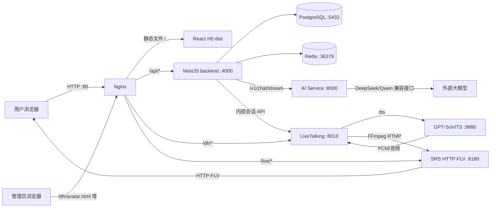

# 炎华众康主动健康管理系统——服务器项目完整交接说明

> 文档性质：生产/演示服务器现状交接文档  
> 核查时间：2026-08-24 14:45—15:05（CST）  
> 核查依据：服务器 `/mnt/newdisk/opt/AIAgents/HealthyDigitalHuman` 下的实际文件、PM2 进程、监听端口、Nginx/SRS 配置、PostgreSQL 表结构及只读聚合数据  
> 核查方式：全程只读；未修改、构建、重启或写入服务器  
> 重要原则：本文描述的是服务器当前状态。服务器与本地不一致时，以本文记录的服务器文件为准。

## 1. 一页结论

该项目是一套“手机号登录 + 健康建档 + AI 健康问答 + 实时数字人播报 + 管理后台”的初步完整系统，主要由以下组件组成：

1. React H5：用户登录、建档、聊天、档案查看和数字人播放。
2. NestJS 后端：用户、认证、建档、聊天、管理后台、形象分配、数字人会话安全编排。
3. Python AI 服务：LangGraph 调度、健康问答、流式回答和语义朗读分段。
4. LiveTalking：数字人生成、字幕、会话生命周期、形象资产管理、FFmpeg 推流。
5. GPT-SoVITS：把 AI 文本合成为语音。
6. SRS：接收 RTMP 推流并提供 HTTP-FLV 播放。
7. Nginx：对外提供 H5、后端 API、数字人管理页和直播流反向代理。
8. PostgreSQL：保存用户、健康档案、聊天、管理员、形象和审计数据。
9. Redis：保存缓存、AI FAQ 缓存和短生命周期数字人会话状态。
10. PM2：管理 backend、ai、tts、dh 四个业务进程。

服务器当前整体可运行：四个 PM2 进程均为 `online`；后端健康接口显示 PostgreSQL、Redis 已连接；AI 服务健康检查正常；数字人管理页和 TTS 文档接口可访问。

但必须首先认识三个现状：

- 数字人“控制面”的用户/会话鉴权代码已经部署并构建，动态流、随机会话、独立 UDP 音频端口也已实现。
- Nginx 尚未部署动态 `/live/dh_*.flv` 的 `auth_request` 媒体鉴权，SRS 的 8180 端口仍对公网映射。因此目前不能声称播放链路已经达到“百分之百用户隔离”。
- “指定一个形象，让接下来 N 个新用户自动分配到该形象”的批次分配策略尚未实现；当前只有迁移分配、管理员手动分配和默认形象回退。

## 2. 服务器目录与组件

项目根目录：

```text
/mnt/newdisk/opt/AIAgents/HealthyDigitalHuman
```

| 目录 | 作用 | 技术栈 | 当前运行方式 |
|---|---|---|---|
| `yhzk-demo-h5` | 用户 H5 前端 | React 18、TypeScript、Vite、flv.js | 构建后由宿主机 Nginx 提供静态文件 |
| `yhzk-mvp-backend` | 主业务 API 和管理 API | NestJS 10、TypeORM、PostgreSQL、Redis | PM2：`dist/main.js` |
| `ai-service` | AI 编排与流式回答 | FastAPI、LangGraph、LangChain、DeepSeek/Qwen 接口 | PM2：Uvicorn，127.0.0.1:8000 |
| `LiveTalking-main` | 数字人运行时和形象管理页面 | Python、aiohttp、Wav2Lip、FFmpeg | PM2：Python，0.0.0.0:8010 |
| `TTS/GPT-SoVITS-main` | 文本转语音 | GPT-SoVITS、FastAPI | PM2：Python，127.0.0.1:9880 |
| `deploy` | 部署示例和隔离方案说明 | Nginx/脚本/Markdown | 当前示例未完整合并到线上 Nginx |
| `deploy-backup` | 数据库发布前备份 | PostgreSQL custom dump | 已有 2026-08-11、2026-08-13 备份 |
| `back`、`backups` | 历史备份/临时留档 | 不属于主运行入口 | 接手后只归档，不应直接覆盖生产文件 |

服务器各组件目录没有检测到可用的 Git 仓库元数据，因此不能在服务器上依赖 `git log`、分支或标签判断版本。版本追踪必须依靠本地 Git、上传清单、构建时间和文件哈希。

## 3. 总体架构



### 3.1 用户问答到数字人播报的数据流

1. H5 通过 `POST /api/v1/chat/message` 把用户问题发送到 NestJS。
2. NestJS 加载用户健康档案、最近对话和会话摘要，再请求 Python AI 服务的 `/v1/chat/stream`。
3. AI 服务先由 `orchestrator` 判断意图，再按需进入 `knowledge_qa`。
4. AI 的原始 token 继续用于前端逐字显示；另一条独立的 `speech_chunk` 流只用于数字人朗读。
5. `SpeechChunkStream` 优先按强标点切分，弱标点达到最小长度后切分；超长无标点内容不会贸然截断。
6. H5 收到 `speech_chunk` 后，通过带 JWT、会话 ID 和控制令牌的数字人会话接口逐段发送。
7. NestJS 检查该数字人会话是否属于当前用户，再调用 LiveTalking 内部接口。
8. LiveTalking 调用 GPT-SoVITS 生成语音，用独立 UDP 端口送入该会话的 FFmpeg，同时驱动 Wav2Lip 画面。
9. FFmpeg 把每个动态会话推到独立的 `live/dh_<随机流键>`。
10. SRS 转为 HTTP-FLV，flv.js 在 H5 播放；字幕通过该会话的字幕事件接口轮询同步。

## 4. 当前运行状态

### 4.1 PM2 进程

| PM2 名称 | 工作目录 | 启动入口 | 监听/用途 | 核查状态 |
|---|---|---|---|---|
| `backend` | `yhzk-mvp-backend` | `dist/main.js` | 实际监听 `*:4000` | online |
| `ai` | `ai-service` | Uvicorn `app.main:app` | `127.0.0.1:8000` | online |
| `tts` | `TTS/GPT-SoVITS-main` | `api_v2.py` | `127.0.0.1:9880` | online |
| `dh` | `LiveTalking-main` | `app.py` | `0.0.0.0:8010` | online |

注意：后端 `.env` 中写的是 `PORT=3000`，但 PM2 运行环境使后端实际监听 4000。所有运维判断应以 `ss` 和 PM2 实际状态为准；接手后应统一这个配置，避免误判。

### 4.2 基础设施

| 服务 | 运行方式 | 端口/映射 | 用途 |
|---|---|---|---|
| 宿主机 Nginx 1.24 | system service | 80、443 | 主站入口和反向代理 |
| SRS 6 | Docker `srs` | 1935、1985、8180、8100/UDP | RTMP、API、HTTP-FLV、WebRTC |
| PostgreSQL 15 | Docker `pg15` | 5432 | 主业务数据库 |
| Redis | Docker `redis` | 宿主机 36379 → 容器 6379 | 缓存和会话状态 |
| FFmpeg 6.1.1 | 宿主机进程/子进程 | 每会话使用独立 UDP 音频端口 | 数字人音视频合流和 RTMP 推流 |

同一服务器还运行 GitLab、MinIO、Ollama、其他 MySQL/MongoDB 等容器，但它们未被当前项目代码引用，不属于本项目交接范围，不应随本项目重启或清理。

### 4.3 健康检查快照

- NestJS `/api/v1/health`：`degraded`。
  - PostgreSQL：connected。
  - Redis：connected。
  - Milvus：disabled（not deployed）。
- AI `/healthz`：ok，启用 `orchestrator` 和 `knowledge_qa`。
- AI `/readyz`：ready，但目前只检查 API 自身，没有检查大模型、Redis 或 Milvus。
- LiveTalking `/avatar.html`：HTTP 200。
- GPT-SoVITS `/docs`：HTTP 200。

后端的 `degraded` 不是 PostgreSQL/Redis 故障，而是 Milvus 未部署。当前 AI 配置默认 `rag_enabled=false`，所以系统仍能问答，但不是真正启用了向量知识库检索。

## 5. H5 用户前端

服务器路径：`yhzk-demo-h5`

### 5.1 已实现功能

- 手机号 + 验证码登录。
- 未知手机号首次登录时创建新用户。
- 新用户进入健康建档流程。
- 建档页面可退出回登录页，避免被永久困在建档页。
- 用户档案读取、编辑和重新建档。
- 老年模式、关怀模式展示。
- AI 流式回答、历史会话和历史消息。
- 动态数字人会话创建、心跳、重连、打断、结束、字幕轮询。
- 数字人 HTTP-FLV 播放、断流恢复和直播边缘追赶。
- 用户登出时撤销当前登录状态并关闭/失效对应数字人会话。
- 本地建档标志和最近会话按用户 ID 分开保存，降低同浏览器切换账号时的串号风险。

### 5.2 当前登录策略

H5 当前对用户只展示手机号登录。后端仍保留微信登录 API，但当前阶段没有接入 H5；游客转正式用户也没有作为当前流程启用。

### 5.3 构建与部署

- Nginx 静态根目录：`yhzk-demo-h5/dist`。
- 当前线上构建文件时间：2026-08-17 10:52。
- 当前构建产物中已经检测到动态数字人会话和 `speech_chunk` 标记，说明后续功能不只是上传源码，H5 构建产物也已发布。
- `.env` 仍保留 `VITE_DH_STREAM_URL=/live/hdh.flv`、`VITE_DH_SESSION_ID=0` 等旧变量，但当前动态会话客户端不再以它们作为用户会话的主路径。建议后续删除过期变量，避免新同事误用。

关键文件：

```text
yhzk-demo-h5/src/App.tsx
yhzk-demo-h5/src/services/auth.ts
yhzk-demo-h5/src/services/chat.ts
yhzk-demo-h5/src/services/digitalHumanSession.ts
yhzk-demo-h5/src/components/DigitalHumanPlayer.tsx
yhzk-demo-h5/src/components/liveEdgeChase.ts
yhzk-demo-h5/src/components/dynamicPlayerPolicy.ts
```

## 6. NestJS 主后端

服务器路径：`yhzk-mvp-backend`

技术栈：NestJS 10、TypeORM 0.3、PostgreSQL、ioredis、JWT、Swagger、class-validator。

全局 API 前缀：`/api/v1`。

### 6.1 模块清单

| 模块 | 作用 |
|---|---|
| `auth` | 微信/手机号登录、验证码、JWT、refresh token、登出 |
| `user` | 当前用户基本资料和模式设置 |
| `onboarding` | 分步建档、跳过步骤、提交档案 |
| `chat` | 会话、消息、SSE、AI 服务调用、上下文和记忆 |
| `advisor` | 健康顾问匹配和查询 |
| `notification` | 短信通知入口 |
| `admin-auth` | 超级管理员登录、Cookie/JWT 校验和初始化 |
| `admin-audit` | 管理操作审计 |
| `admin-user` | 用户增删改查、停用、恢复、软删除、回收站恢复 |
| `avatar-admin` | 形象上传、预览、删除检查、默认形象、测试运行、用户换形象 |
| `digital-human` | 用户独立数字人会话、媒体票据、Redis 状态和清理 |
| `health` | 依赖健康检查 |

### 6.2 主要 API

认证与用户：

```text
POST /api/v1/auth/phone/send-code
POST /api/v1/auth/phone/login
POST /api/v1/auth/wechat/login
POST /api/v1/auth/refresh
POST /api/v1/auth/logout
GET  /api/v1/user/me
PUT  /api/v1/user/me
```

建档：

```text
GET  /api/v1/onboarding/profile
PUT  /api/v1/onboarding/profile/step/:step
POST /api/v1/onboarding/profile/skip-step
POST /api/v1/onboarding/profile/submit
```

聊天：

```text
POST /api/v1/chat/message       SSE
POST /api/v1/chat/simple        JSON
POST /api/v1/chat/send          JSON
GET  /api/v1/chat/sessions
GET  /api/v1/chat/sessions/:sessionId/messages
```

管理员：

```text
POST   /api/v1/admin/auth/login
POST   /api/v1/admin/auth/logout
GET    /api/v1/admin/auth/me
GET    /api/v1/admin/users
GET    /api/v1/admin/users/recycle-bin
POST   /api/v1/admin/users
PATCH  /api/v1/admin/users/:userId
PATCH  /api/v1/admin/users/:userId/disable
PATCH  /api/v1/admin/users/:userId/restore
DELETE /api/v1/admin/users/:userId
PATCH  /api/v1/admin/users/recycle-bin/:userId/restore
```

形象：

```text
GET    /api/v1/admin/avatars
POST   /api/v1/admin/avatars
GET    /api/v1/admin/avatars/:avatarId/preview
GET    /api/v1/admin/avatars/:avatarId/delete-check
DELETE /api/v1/admin/avatars/:avatarId
PATCH  /api/v1/admin/avatars/:avatarId/default
POST   /api/v1/admin/avatars/:avatarId/test-run
GET    /api/v1/admin/users/:userId/avatar
PATCH  /api/v1/admin/users/:userId/avatar
GET    /api/v1/admin/audit
```

用户独立数字人：

```text
POST   /api/v1/digital-human/session
POST   /api/v1/digital-human/session/speak
POST   /api/v1/digital-human/session/interrupt
POST   /api/v1/digital-human/session/heartbeat
GET    /api/v1/digital-human/session/subtitles
DELETE /api/v1/digital-human/session
GET    /api/v1/digital-human/media/authorize
```

### 6.3 用户生命周期规则

- 新用户手机号登录：找不到手机号时创建 `registered` 用户，之后进入建档。
- 修改手机号：修改的是同一用户记录，不应新建档案；旧手机号之后会被视为未知手机号，可重新注册新账号。
- 停用：写入 `disabled_at`，增加 `auth_version`，撤销 refresh token，并定向关闭该用户的数字人会话。
- 恢复停用：清空 `disabled_at`，再次增加 `auth_version`。
- 删除：软删除，写入 `deleted_at`，同时停用、撤销 token、结束当前形象分配并关闭数字人会话。
- 回收站恢复：恢复用户主体和历史业务数据，但保持停用状态；旧登录令牌和旧形象分配不会自动恢复。管理员需再次启用并重新检查形象。

所有新增、修改、停用、恢复、删除、回收站恢复、换形象等动作均写入 `admin_audit_logs`，包括管理员、时间、资源、前后数据、IP、User-Agent、成功状态和错误信息。

### 6.4 管理员角色

当前仅接受 `super_admin`。数据库已经拆分为角色、权限、角色权限表，为以后扩展运营、客服、审核等角色预留了结构，但后端守卫目前明确要求 `super_admin`，还没有细粒度权限判断。

管理员使用 HttpOnly Cookie `yhzk_admin_session` 或 Bearer Token。当前是 HTTP，所以 `ADMIN_COOKIE_SECURE=false`；正式 HTTPS 后必须改为 `true`。

## 7. AI 服务

服务器路径：`ai-service`

### 7.1 当前启用能力

- `orchestrator`：识别健康问题、一般对话和紧急情况，处理上下文与情绪。
- `knowledge_qa`：生成健康问答，带用户档案摘要和历史会话记忆。
- Redis FAQ 缓存：键前缀 `faq_cache:<userId>:<questionHash>`，默认一小时。
- SSE 流式接口：`POST /v1/chat/stream`。
- 非流式接口：`POST /v1/chat`。
- 会话摘要：`POST /v1/memory/summarize`。
- 强标点优先的语义朗读分段：向 H5 发送独立 `speech_chunk` 事件。

### 7.2 语义朗读分段

文件：`ai-service/app/utils/speech_stream.py`

当前规则：

- 强边界：句号、问号、感叹号、分号等，出现后立即形成朗读段。
- 弱边界：逗号、顿号、冒号等，累计至少 12 个字符后才切。
- 建议最大长度 28 个字符；无合理标点时宁可等到结尾，不在词中间硬切。
- 去除 Markdown 符号、分隔线和括号噪声，将换行压成中文逗号。
- 屏幕显示仍使用原始 token，不受朗读清洗影响。

AI 提示词还要求第一句话使用“好的！”“明白了！”或“嗯！”等强标点确认词。因此服务器确实采用了之前讨论的“强标点尽快发送”策略。

### 7.3 当前限制

- `rag_enabled` 没有在 `.env` 启用，默认是 false。
- Milvus 19530 未部署，后端健康状态因此为 degraded。
- `readyz` 只检查 FastAPI 自身，未检查 DeepSeek、Redis、Milvus。
- CORS 当前为 `*`，因服务只监听 127.0.0.1 风险有限；若以后直接公网暴露，必须收紧。

## 8. LiveTalking 数字人运行时

服务器路径：`LiveTalking-main`

### 8.1 当前固定进程

PM2 的 `dh` 进程以 Wav2Lip、形象 `1005` 启动，固定测试/管理流为 `live/hdh`，监听 8010，TTS 指向 9880。这个固定形象主要是管理测试和兼容旧页面；正式用户动态会话会按数据库分配另起会话和随机流键。

### 8.2 动态会话能力

- 最多 10 个并发数字人会话。
- 管理/固定会话音频端口：19876。
- 动态 UDP 音频端口池：21000—21009。
- 动态推流前缀：`rtmp://127.0.0.1:1935/live/dh_`。
- 每个会话使用随机 session ID、随机 stream key、独立控制令牌和独立音频端口。
- 输出就绪超时：30 秒。
- FFmpeg 使用 `libx264`、`ultrafast`、`zerolatency`、25 FPS，并在队列满时丢旧帧，避免延迟无限累积。
- 新会话准备就绪后才替换旧会话；失败时回滚并释放端口。
- 心跳丢失、用户登出、停用或删除时可定向停止对应会话。
- 形象切换不打断当前对话；用户下次刷新或重新进入建立新会话时使用新形象。

### 8.3 内部接口

动态用户会话通过 `/api/internal/digital-human/sessions...` 访问，要求内部令牌。字幕、说话、打断、状态和停止都按 session ID 定向执行。

LiveTalking 同时保留 `/human`、`/interrupt_talk`、`/api/digital-human/connect` 等旧公共兼容接口。接手者不要用这些接口开发新用户会话；新功能必须走 NestJS 的 `/api/v1/digital-human/*`。

## 9. GPT-SoVITS

服务器路径：`TTS/GPT-SoVITS-main`

- PM2 启动：`api_v2.py -a 127.0.0.1 -p 9880`。
- 主要接口：`GET/POST /tts`，控制接口 `/control`。
- 参考音频：`TTS/voice1.mp3`。
- 预训练模型目录约 4.6 GB。
- 只绑定 127.0.0.1，不直接向公网开放，由 LiveTalking 调用。
- LiveTalking 的 `tts/sovits.py` 负责把分段文本请求到 9880，并把音频交给对应数字人会话。

### 9.1 NestJS TTSService / Viseme 当前状态（2026-08-27 核查）

- `yhzk-mvp-backend/src/modules/chat/tts/tts.service.ts` 会生成 `audioUrl` 和 `visemeTimeline`；Python AI 分支会将它们作为 `audio` / `visemes` SSE 事件发送，并写入 `chat_messages` 的 `tts_url` / `viseme_data`。
- H5 虽然声明了 `visemes` 事件类型，但 `yhzk-demo-h5/src/services/chat.ts` 实际不处理 `audio` 和 `visemes`，数字人播放与口型都不消费这份时间轴。
- 当前有效链路是：H5 将 AI 分段文本发到 `/digital-human/session/speak` → LiveTalking 调用 GPT-SoVITS 生成音频 → Wav2Lip 根据音频驱动口型。NestJS 生成的 viseme 不参与该链路。
- legacy/直达回退分支对 `TTSService.synthesize()` 没有 `await`，保存消息时 `tts_url` / `viseme_data` 通常仍为 `null` / `[]`。
- 结论：这套 viseme 目前属于“会生成、可能传输和入库，但没有业务消费者”的遗留功能。后续若不计划做前端骨骼/表情口型驱动，建议移除或停止调用 NestJS TTSService，避免重复 TTS 开销。

## 10. 形象管理系统

入口：

```text
http://115.190.225.138/dh/avatar.html
```

### 10.1 已实现功能

- 超级管理员账号密码登录。
- 查看形象列表、状态、模型、默认形象、已分配用户数。
- 预览图显示。
- 上传视频创建新形象。
- 上传前由后端签发一次性上传票据。
- 支持 mp4、mov、avi、mkv、webm，服务器配置最大 100 MB。
- 上传视频后立即提取第一帧作为预览图。
- 后台生成 Wav2Lip 或 MuseTalk 资产并回调任务状态。
- 设置默认形象。
- 测试运行形象。
- 删除前检查默认状态、分配用户和运行中会话。
- 删除通过后把资产移动到 `data/avatar_trash`，属于可恢复的文件级删除方式。
- 管理操作审计。

### 10.2 服务器现有形象

服务器数据库和磁盘均确认存在 9 个 ready 的 Wav2Lip 形象：

```text
1001 1002 1003 1004 1005 1006 1007 1008 wav2lip256_avatar1
```

每个形象都有对应 JPG 预览图。当前默认形象是 `1006`。当前活动分配主要集中在 `1005`，另有少量分配到 `1002` 和 `1007`。

### 10.3 尚未实现的自动批次分配

需求“管理员设置某形象，接下来 N 个新用户自动分配该形象，初始 N 不超过 10”在服务器代码中尚未实现。依据如下：

- 数据库没有分配策略/批次/剩余名额表。
- `UserAvatarAssignmentService` 只处理 `manual`、`migration` 和默认形象回退。
- 新用户注册逻辑没有消耗“下一批 N 人”的计数。
- 形象管理页面没有该策略的配置控件。

当前行为是：有活动手动/迁移分配则使用它；否则使用 `is_default=true` 的 ready 形象。

## 11. 用户管理系统

入口：

```text
http://115.190.225.138/dh/users.html
http://115.190.225.138/dh/user-recycle-bin.html
```

### 11.1 已实现功能

- 用户分页、手机号/用户 ID 搜索、建档状态筛选。
- 新增手机号用户。
- 修改手机号。
- 设置老年模式和关怀模式。
- 停用和恢复账号。
- 软删除。
- 回收站查看与恢复。
- 查看和手动更换用户形象。
- 操作审计。

当前数据库快照：17 个用户，其中 12 个已建档、5 个 registered；16 个正常、1 个软删除；1 个开启关怀模式。

### 11.2 换形象规则

- 多个用户可以分配到同一个形象。
- 每个用户同时只有一个有效的显式分配。
- 管理员换形象会结束旧分配并新增 `manual` 分配历史。
- 当前数字人会话保持不变；刷新或重新进入后创建的新会话才读取新形象。
- 用户删除时当前形象分配结束；从回收站恢复后不会自动恢复旧分配。

## 12. 数据库

### 12.1 PostgreSQL

数据库：PostgreSQL 15，当前业务库名为 `default_db`。

| 表 | 当前行数 | 存储内容 |
|---|---:|---|
| `users` | 17 | 手机号、微信标识、状态、老年/关怀模式、登录时间、停用/删除时间、鉴权版本 |
| `health_profiles` | 15 | 建档步骤、状态、JSON 档案、跳过步骤、提交时间 |
| `sms_codes` | 41 | 手机号验证码、用途、是否使用、过期时间 |
| `refresh_tokens` | 56 | 用户 refresh token、设备信息、撤销和过期状态、鉴权版本 |
| `chat_sessions` | 110 | 用户会话、上下文级别、摘要、消息数、过期时间 |
| `chat_messages` | 902 | 角色、正文、意图、置信度、情绪、引用、TTS/口型/快捷回复元数据 |
| `advisor_match` | 12 | 用户与顾问匹配、分数和维度数据 |
| `admin_users` | 1 | 管理员账号、密码哈希、角色、登录状态 |
| `admin_roles` | 1 | 当前超级管理员角色 |
| `admin_permissions` | 6 | 预留权限定义 |
| `admin_role_permissions` | 6 | 角色权限关联 |
| `admin_audit_logs` | 43 | 管理操作审计 |
| `digital_human_avatars` | 9 | 形象状态、预览、源视频、默认标志、软删除 |
| `avatar_generation_tasks` | 0 | 形象生成任务；当前无待处理历史记录 |
| `user_avatar_assignments` | 19 | 用户形象分配历史，含来源、管理员、开始/结束时间 |

部分 JSON 字段通过 TypeORM `simple-json` 存成 PostgreSQL text，例如档案、审计前后数据、消息元数据。排查时要先转换为 `jsonb` 才能使用 `->>`，例如：

```sql
(before_data::jsonb)->>'phone'
```

### 12.2 已执行迁移与备份

迁移：

```text
migrations/20260811_avatar_management.sql
migrations/20260813_admin_user_lifecycle.sql
```

备份：

```text
deploy-backup/avatar-management-20260811/database.dump
deploy-backup/admin-user-lifecycle-20260813-143912/database.dump
```

### 12.3 Redis

代码定义的主要键：

```text
context:<userId>:<sessionId>          对话上下文
sms:rate:<phone>                      短信频率
sms:daily:<phone>                     短信每日计数
chat:rate:<userId>                    聊天频率
token:blacklist:<jti>                 token 黑名单
user:<userId>:profile                 用户档案缓存
faq_cache:<userId>:<questionHash>     AI FAQ 缓存
dh:active:user:<userId>               用户当前活动数字人会话
dh:pending:user:<userId>              待激活会话
dh:revocation:user:<userId>           撤销代次
dh:session:<sessionId>                会话记录
dh:lock:user:<userId>                 用户会话创建锁
dh:sessions:heartbeat                 心跳索引
dh:lock:cleanup                       清理任务锁
```

数字人会话默认 TTL 180 秒，H5 每 30 秒心跳续期。Redis 故障时后端对数字人会话采取失败关闭策略，不应绕过状态仓库直接控制 LiveTalking。

## 13. Nginx 与 SRS

### 13.1 当前 Nginx 实际配置

配置文件：`/etc/nginx/sites-available/yhzk`

当前只有四个简单 location：

```nginx
location /      { try_files $uri $uri/ /index.html; }
location /api/  { proxy_pass http://127.0.0.1:4000; proxy_buffering off; }
location /dh/   { proxy_pass http://127.0.0.1:8010/; }
location /live/ { proxy_pass http://127.0.0.1:8180; }
```

### 13.2 当前 SRS 实际配置

配置文件：`/mnt/newdisk/opt/SRS/conf/srs.conf`

- `gop_cache on`。
- `queue_length 10`。
- HTTP-FLV、HLS、WebRTC 均启用。
- SRS security 关闭。
- 没有启用之前讨论的 `tcp_nodelay on`、`min_latency on`、`gop_cache off` 等低延迟参数。

这符合之前“先不动 SRS 和 Nginx，只改播放器/应用代码”的决策，但也意味着基础设施层的直播延迟还没有优化。

### 13.3 最重要的部署缺口

代码设计要求动态流必须经过：

```text
Nginx /live/dh_*.flv
  -> auth_request /api/v1/digital-human/media/authorize
  -> 校验 HttpOnly 媒体票据、随机流键、会话代次、活动状态
  -> SRS
```

服务器当前 Nginx 没有这个专用 location，所有 `/live/*` 都直接转发到 SRS；Docker 还把 8180 映射到 `0.0.0.0`。因此：

- 随机流地址降低了被猜中的概率，但地址一旦泄露，Nginx 不会调用 NestJS 校验当前用户。
- 直接访问 `http://服务器:8180/...` 可以绕过 Nginx。
- `/dh/` 通用代理也没有在网关层屏蔽 `/api/internal/`、`/api/admin/`；内部接口自身有令牌校验，但仍不符合预期的纵深防护。

在完成 Nginx 专用鉴权 location、关闭公网 8180、阻断内部路径并通过双用户串流测试之前，不应对外承诺“播放内容百分之百隔离”。

## 14. 安全与隔离现状

### 14.1 已实现的保护

- 普通 API 使用用户 JWT。
- 数字人接口额外要求真实用户，`demo_` token 被 `RealUserGuard` 拒绝。
- 会话记录绑定 userId；控制令牌只保存哈希，使用常量时间比较。
- 动态 session ID 和 stream key 都是 32 字节随机值。
- 媒体票据绑定 session、stream key 和 generation，并通过 HttpOnly、SameSite=Strict Cookie 下发。
- 同一用户新会话激活后替换旧会话；不同用户使用不同会话、推流键和 UDP 音频端口。
- 停用、删除、登出会撤销令牌或定向关闭会话。
- 管理员密码以哈希保存；管理员操作有审计。
- LiveTalking 内部动态会话和形象内部接口需要内部令牌。

### 14.2 尚未闭环或需整改

1. 当前只有 HTTP，登录、健康数据和媒体链路没有 TLS 传输加密。
2. Nginx 未执行动态媒体票据鉴权，SRS 8180 公网暴露。
3. PM2 中 backend 的 `NODE_ENV=development`；Swagger 对外可用，TypeORM 在未设置 `DB_SYNCHRONIZE` 时会默认 `synchronize=true`。这是生产数据结构风险，应改成 production 并明确 `DB_SYNCHRONIZE=false`。
4. `JwtAuthGuard` 保留 `demo_` 前缀绕过逻辑。数字人已阻止 demo token，但其他受 JWT 保护的接口仍可能接受 demo token；正式上线前应删除或用显式开发开关控制。
5. 管理员 Cookie 和媒体 Cookie 因 HTTP 设置为 `Secure=false`；切换 HTTPS 后必须同时改为 true。
6. PostgreSQL 和 Redis 通过宿主机公网地址/映射端口连接。应使用本机/内网地址并限制防火墙来源。
7. `.env` 包含数据库密码、API Key 和多个内部密钥，不能纳入 Git、文档、截图或聊天记录。

## 15. 本地与服务器上传核对

### 15.1 核对方法

对服务器 9 个生产源码目录进行了 SHA-256 对比：

```text
yhzk-mvp-backend/src
yhzk-mvp-backend/migrations
yhzk-demo-h5/src
LiveTalking-main/server
LiveTalking-main/streamout
LiveTalking-main/tts
LiveTalking-main/web
LiveTalking-main/scripts
ai-service/app
```

结果：

| 项目 | 数量 |
|---|---:|
| 服务器文件 | 248 |
| 本地文件 | 254 |
| 内容完全一致 | 234 |
| 同路径但内容不同 | 9 |
| 仅服务器存在 | 5 |
| 仅本地存在 | 11 |

### 15.2 已确认上传并生效的后续功能

以下关键源码与当前本地工作区哈希一致，且相应运行产物或直接运行进程中已检测到功能标记：

- AI `speech_chunk` 语义朗读分段：已上传；AI 直接运行源码，已生效。
- H5 接收 `speech_chunk` 并排队朗读：已上传；线上 dist 已包含，已生效。
- H5 动态数字人会话客户端：已上传；线上 dist 已包含。
- NestJS 数字人会话、媒体票据、Redis 仓库、清理任务：已上传；2026-08-17 的 dist 已包含并由 PM2 运行。
- LiveTalking 随机会话、内部令牌、独立音频端口池、动态 RTMP、定向字幕/打断：已上传；DH 直接运行源码。
- 用户 CRUD、停用、恢复、软删除、回收站：服务器源码和构建产物存在并已通过实际页面使用。
- 形象列表、预览、上传首帧、删除检查、测试运行、用户手动换形象：服务器源码、页面和数据库结构均存在。

### 15.3 差异文件

同路径内容不同的 9 个文件：

```text
LiveTalking-main/tts/base_tts.py
LiveTalking-main/tts/edge.py
LiveTalking-main/web/rtmpapi.html
yhzk-mvp-backend/src/modules/admin-user/admin-user.controller.spec.ts
yhzk-mvp-backend/src/modules/admin-user/admin-user.service.spec.ts
yhzk-mvp-backend/src/modules/admin-user/admin-user.service.ts
yhzk-mvp-backend/src/modules/avatar-admin/avatar-admin.service.spec.ts
yhzk-mvp-backend/src/modules/avatar-admin/avatar-admin.store.spec.ts
yhzk-mvp-backend/src/modules/avatar-admin/avatar-import.store.spec.ts
```

其中多数是测试或旧演示页面，不影响当前生产入口。`admin-user.service.ts` 是重要差异：服务器版本包含当前线上使用的回收站恢复、令牌撤销、形象分配结束和数字人定向关闭逻辑。接手时不要直接用本地同名文件覆盖服务器，应先做三方 diff，并以服务器行为和测试要求合并。

仅服务器存在的 5 个文件：

```text
LiveTalking-main/streamout/audio_primer.py
yhzk-demo-h5/src/services/subtitleSync.ts
yhzk-mvp-backend/src/modules/avatar-admin/admin-user.controller.ts
yhzk-mvp-backend/src/modules/avatar-admin/admin-user.dto.ts
yhzk-mvp-backend/src/modules/avatar-admin/admin-user.service.ts
```

后三个 `avatar-admin/admin-user.*` 是历史遗留副本，当前 `AvatarAdminModule` 没有注册它们；真正线上用户管理来自 `src/modules/admin-user/`。应在建立可靠 Git 基线后删除或归档，防止误改。

仅本地存在的 11 个文件全部是新增测试文件，没有服务器生产运行依赖。它们可以保留在本地用于回归，不必上传。

## 16. 当前完成功能与未完成事项

### 16.1 已完成并部署

- 手机号登录和新用户自动创建。
- 健康建档、档案查看/编辑、建档退出。
- AI 流式问答、上下文、记忆摘要、情绪和应急意图。
- 强标点优先语义朗读分段。
- 数字人播放器追赶和恢复。
- 形象资产导入、预览、视频上传首帧、生成、删除检查、默认形象和测试运行。
- 超级管理员登录和审计。
- 用户增删改查、手机号修改、关怀/老年模式。
- 停用、恢复、软删除和回收站恢复。
- 管理员手动给用户换形象。
- 用户独立动态数字人会话代码、独立推流键和音频端口。

### 16.2 代码已部署但基础设施未完整启用

- 动态流媒体票据鉴权：NestJS 已实现，Nginx 未接入。
- 内部 LiveTalking 路径隐藏：代码有内部令牌，Nginx 未显式 404 阻断。
- 完整双用户媒体隔离：控制面具备，媒体面还需 Nginx/SRS 网络收口和双浏览器验收。

### 16.3 尚未开发或未启用

- “接下来 N 个新用户自动分配指定形象”的可配置批次策略。
- 微信登录的 H5 实际入口。
- 游客转正式用户。
- 多管理员角色和细粒度权限。
- Milvus 部署和真正的 RAG 知识库。
- 正式 HTTPS。
- SRS/Nginx 低延迟参数优化。

## 17. 运维操作

以下命令供新同事使用。执行前必须确认目录、备份和构建退出码；不要在构建失败时重启。

### 17.1 查看状态

```bash
pm2 status
ss -ltnp | grep -E ':(4000|8000|8010|9880|1935|8180)'
curl -sS http://127.0.0.1:4000/api/v1/health
curl -sS http://127.0.0.1:8000/healthz
curl -sS http://127.0.0.1:8000/readyz
```

### 17.2 日志

```text
/home/opt/.pm2/logs/backend-out.log
/home/opt/.pm2/logs/backend-error.log
/home/opt/.pm2/logs/ai-out.log
/home/opt/.pm2/logs/ai-error.log
/home/opt/.pm2/logs/tts-out.log
/home/opt/.pm2/logs/tts-error.log
/home/opt/.pm2/logs/dh-out.log
/home/opt/.pm2/logs/dh-error.log
/var/log/nginx/access.log
/var/log/nginx/error.log
/mnt/newdisk/opt/SRS/logs/srs.log
```

SRS 日志当前约 225 MB，应配置 logrotate 或容器日志轮转。

### 17.3 后端构建与重启

```bash
cd /mnt/newdisk/opt/AIAgents/HealthyDigitalHuman/yhzk-mvp-backend
npm run build
BUILD_EXIT=$?
echo "构建退出码：$BUILD_EXIT"

if [ "$BUILD_EXIT" -eq 0 ]; then
  pm2 restart backend --update-env
fi
```

构建成功后再检查健康接口和 `pm2 logs backend --lines 100 --nostream`。

### 17.4 H5 构建

```bash
cd /mnt/newdisk/opt/AIAgents/HealthyDigitalHuman/yhzk-demo-h5
npm run build
```

Nginx 直接读取 `dist`。建议以后构建到版本目录并原子切换，不要边构建边覆盖线上目录。

### 17.5 其他服务重启

```bash
pm2 restart ai --update-env
pm2 restart tts --update-env
pm2 restart dh --update-env
```

只改某个组件就只重启对应服务：

- NestJS 源码并完成 build：重启 `backend`。
- AI Python：重启 `ai`。
- LiveTalking Python、形象运行参数：重启 `dh`。
- GPT-SoVITS：重启 `tts`。
- H5：重新 build，通常不需要重启 PM2。
- Nginx：先 `nginx -t`，再 reload。
- SRS 配置：需要重启 `srs` 容器；当前不要在未备份和未验收时修改。

## 18. 发布与回滚规范

1. 所有修改只在本地 Git 工作区完成，不直接编辑服务器生产文件。
2. 上传前生成“相对路径清单 + SHA-256 + 对应提交号”。
3. 备份将被覆盖的服务器文件；涉及数据库先做 `pg_dump -Fc`。
4. 只上传本次清单中的文件，不整目录覆盖 `.env`、模型、data、dist 或 node_modules。
5. 后端先 build，退出码为 0 后才重启。
6. H5 构建后验证静态资源标记和浏览器无缓存刷新。
7. 修改 Nginx 前备份 `/etc/nginx/sites-available/yhzk`，先 `nginx -t`。
8. 每个组件分别验证，失败只回滚该组件及其后续步骤。
9. 发布后保存服务器哈希快照和验收记录。

特别提醒：当前服务器没有 Git 基线，并且部分生产源码领先于本地已提交 HEAD、只存在于本地工作区和服务器。新同事第一项工作应是把服务器当前源码安全同步到一个新的本地基线分支，排除 `.env`、模型、数据、日志和依赖后提交，禁止直接用旧分支覆盖。

## 19. 故障排查顺序

### 19.1 页面打不开

1. 检查 Nginx 80 端口和 `/var/log/nginx/error.log`。
2. 检查 `yhzk-demo-h5/dist/index.html` 和 assets 是否存在。
3. 检查浏览器 Network 中静态资源是否 404。

### 19.2 登录或用户列表失败

1. 检查 backend online、4000 端口和 health。
2. 检查 PostgreSQL、Redis 连接。
3. 查看 backend error log。
4. 管理页出现 401 时先重新登录管理员，不要把 401 当作接口不存在。

### 19.3 AI 没有回答

1. 检查 AI `/healthz`。
2. 检查 backend 到 `http://localhost:8000`。
3. 查看 ai/backend error log。
4. 检查外部大模型 Key 和网络，但不要在终端输出 Key。

### 19.4 有文字但数字人不说话

1. 检查浏览器是否成功创建 `/api/v1/digital-human/session`。
2. 检查 `dh`、`tts`、SRS 是否在线。
3. 检查 21000—21009 是否耗尽或被占用。
4. 检查 LiveTalking 是否确认 FFmpeg output ready。
5. 检查 H5 是否收到 `speech_chunk`，以及 speak API 是否 2xx。

### 19.5 数字人画面延迟越来越大

1. 检查 flv.js buffered end 与 currentTime 差值和追赶逻辑。
2. 检查 FFmpeg 视频队列是否持续满并丢帧。
3. 检查 SRS 当前 `gop_cache on`、`queue_length 10` 带来的累积。
4. 检查 Nginx `/live/` 未设置 `proxy_buffering off`。

## 20. 接手后的优先工作

### P0：安全闭环

1. 合并动态流 Nginx 专用 location，调用 NestJS `media/authorize`。
2. 关闭 SRS 8180 公网暴露，只允许 Nginx/本机访问。
3. 在 Nginx 阻断公网 `/dh/api/internal/`、`/dh/api/admin/`。
4. 用两个真实用户、两个独立浏览器完成串流、声音、字幕、打断、登出、停用和换形象隔离测试。

### P1：生产配置

1. backend 切为 `NODE_ENV=production`。
2. 明确 `DB_SYNCHRONIZE=false`。
3. 统一 backend 端口配置为 4000 或调整 Nginx/PM2，消除 `.env` 的 3000 歧义。
4. 规划 HTTPS，并在切换时启用两个 Secure Cookie 开关。
5. 收紧数据库、Redis、Swagger 和 demo token。

### P1：版本基线

1. 以服务器当前源码创建只读快照。
2. 与本地工作区做三方合并，重点处理 `admin-user.service.ts`。
3. 清理历史重复文件并补齐部署清单。
4. 确保所有生产源码来自已提交 Git 版本。

### P2：业务后续

1. 开发“指定形象 + 接下来 N 个新用户”的批次分配策略。
2. 部署 Milvus、导入知识库并启用 RAG。
3. 再评估 SRS/Nginx 低延迟配置。
4. 后续再接微信登录和游客转正式用户。

## 21. 新同事首日检查表

- [ ] 阅读本文并确认项目根目录。
- [ ] 只读执行 PM2、端口和四个健康检查。
- [ ] 确认 `.env` 权限，不复制或外发任何密钥。
- [ ] 确认 PostgreSQL 最近一次备份可列出目录。
- [ ] 登录 H5、形象管理、用户管理和回收站页面。
- [ ] 用测试手机号完整走一次登录—建档—问答。
- [ ] 查看一次 AI SSE 中的 token、speech_chunk、done 顺序。
- [ ] 查看一次动态数字人 session、streamUrl、心跳和关闭。
- [ ] 在未改 Nginx 前明确记录媒体鉴权未闭环。
- [ ] 建立服务器当前源码 Git 基线后再开始开发。

## 22. 文档维护要求

每次上线后至少更新：

1. 上线时间、提交号和上传文件清单。
2. 数据库迁移和备份位置。
3. PM2 启动参数、端口、Nginx/SRS 配置变化。
4. 数据库表和 Redis key 变化。
5. 已完成功能、未完成事项和已知风险。
6. 双用户隔离、登录、建档、AI、TTS、播放的验收结果。

任何文档都不得记录真实密码、JWT 私钥、数据库密码、短信密钥、大模型 Key、内部 token 或用户健康明细。
