# 炎华众康 · 系统架构 Mermaid 图解

> 基于《服务器架构与启动指南》整理，将文字架构图转换为可交互的 Mermaid 图表。
> 服务器 IP: `115.190.225.138` | 最后更新: 2026-08-04

---

## 一、系统全景架构图

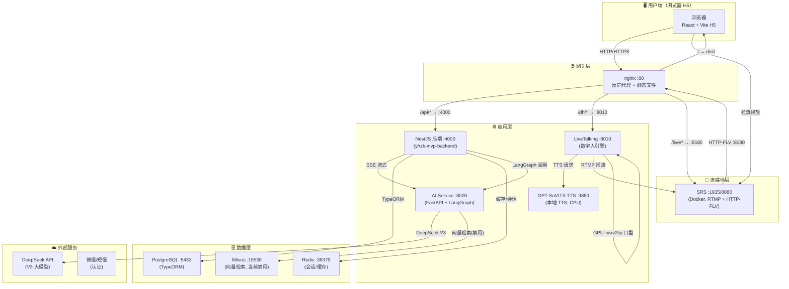

---

## 二、核心数据流图（句级流式链路）

这是系统最关键的数据流：从用户发消息到数字人开口说话。

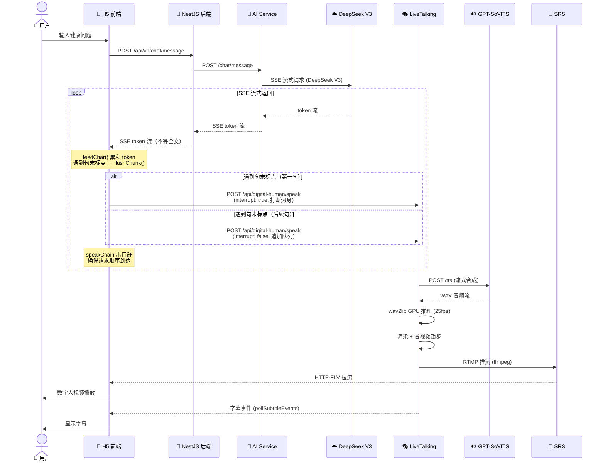

---

## 三、服务依赖与启动顺序图

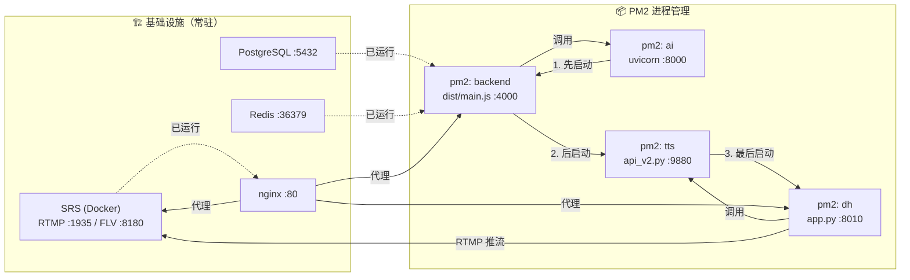

---

## 四、NestJS 后端模块架构

```mermaid
graph TB
    subgraph 入口["🚪 入口层"]
        Main["main.ts"]
        AppModule["AppModule"]
    end

    subgraph 全局["🔧 全局模块"]
        Config["config/ (数据库/JWT/Redis/Milvus/SMS)"]
        Guards["guards/ (JWT, Throttler)"]
        Filters["filters/ (AllExceptions)"]
        Interceptors["interceptors/ (Logging, Response)"]
        Pipes["pipes/ (Validation)"]
    end

    subgraph 业务模块["📦 业务模块"]
        AdminAuth["admin-auth<br/>管理员认证"]
        AdminUser["admin-user<br/>管理员用户"]
        AdminAudit["admin-audit<br/>操作审计"]
        AvatarAdmin["avatar-admin<br/>数字人形象管理"]
        Auth["auth<br/>用户认证 (微信/短信/JWT)"]
        User["user<br/>用户管理"]
        Onboarding["onboarding<br/>健康建档"]
        Chat["chat<br/>对话 (SSE + RAG + TTS)"]
        DigitalHuman["digital-human<br/>数字人会话管理"]
        Advisor["advisor<br/>顾问列表"]
        Notification["notification<br/>通知推送"]
    end

    subgraph 外部["🔌 外部依赖"]
        PG_ORM["PostgreSQL (TypeORM)"]
        Redis_Client["Redis (ioredis)"]
        Milvus_Client["Milvus SDK"]
        AI_Client["AI Service :8000"]
        WeChat_API["微信/短信 API"]
    end

    Main --> AppModule
    AppModule --> Config
    AppModule --> Guards
    AppModule --> Filters
    AppModule --> Interceptors
    AppModule --> Pipes

    AppModule --> AdminAuth
    AppModule --> AdminUser
    AppModule --> AdminAudit
    AppModule --> AvatarAdmin
    AppModule --> Auth
    AppModule --> User
    AppModule --> Onboarding
    AppModule --> Chat
    AppModule --> DigitalHuman
    AppModule --> Advisor
    AppModule --> Notification

    AdminAuth --> PG_ORM
    AdminUser --> PG_ORM
    Auth --> PG_ORM
    Auth --> WeChat_API
    Auth --> Redis_Client
    User --> PG_ORM
    Onboarding --> PG_ORM
    Chat --> PG_ORM
    Chat --> AI_Client
    Chat --> Redis_Client
    Chat --> Milvus_Client
    DigitalHuman --> PG_ORM
    DigitalHuman --> Redis_Client
    Notification --> PG_ORM
```

---

## 五、AI Service (LangGraph) 架构

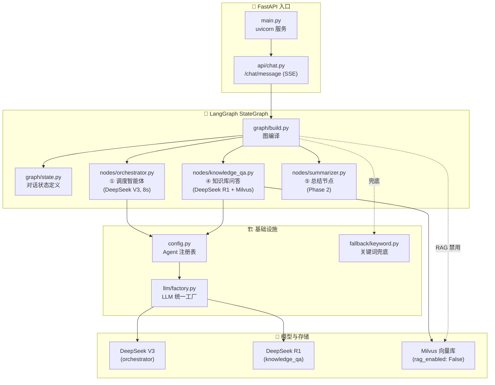

---

## 六、LiveTalking 数字人引擎内部架构

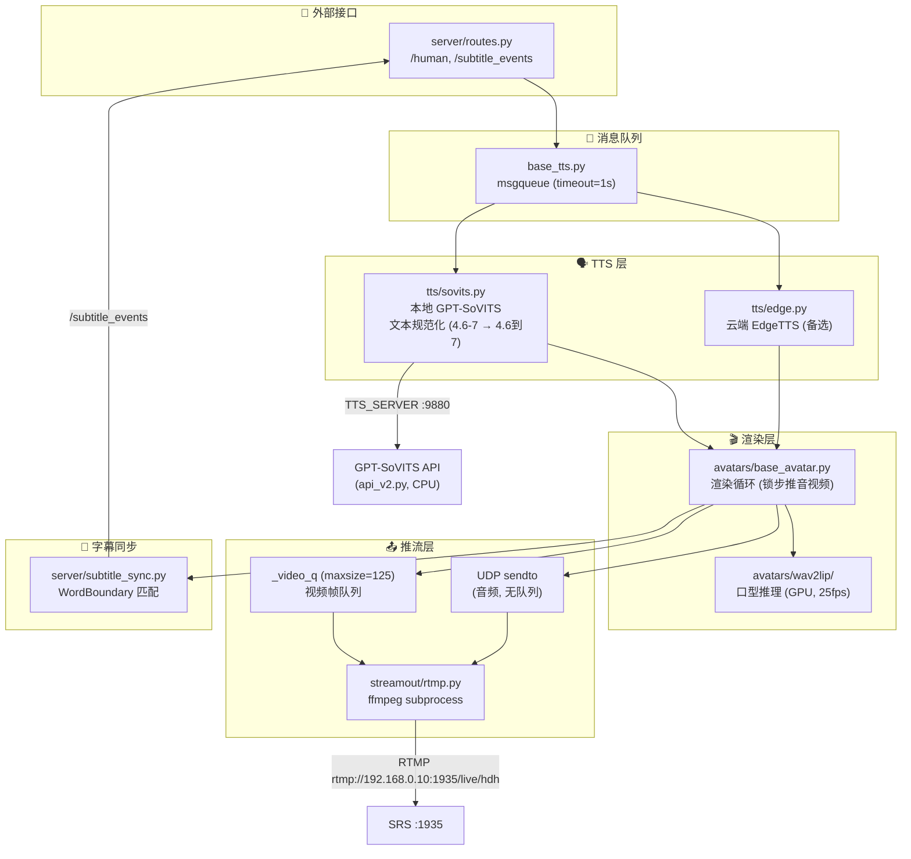

---

## 七、nginx 路由规则图

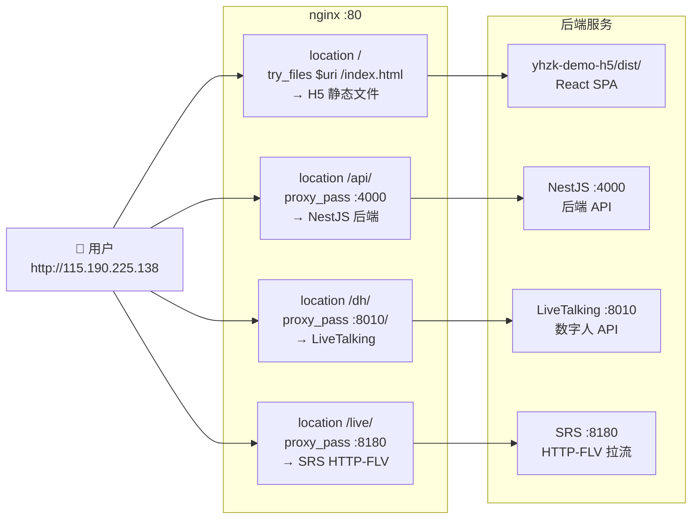

---

## 八、延迟链路分析图

```mermaid
graph LR
    A["用户输入"] -->|"0s"| B["H5 发送消息"]
    B -->|"~100ms"| C["NestJS 接收"]
    C -->|"~50ms"| D["转发 AI Service"]
    D -->|"~50ms"| E["AI Service 处理"]
    E -->|"500~1500ms"| F["DeepSeek 生成首句"]

    F -->|"SSE 逐 token"| G["H5 feedChar()"]
    G -->|"句末标点触发"| H["flushChunk() → speak()"]

    H -->|"~0~1000ms"| I["msgqueue 轮询"]
    I -->|"~300~1000ms"| J["GPT-SoVITS CPU 合成"]
    J -->|"~0ms"| K["wav2lip GPU 推理"]
    K -->|"~0ms"| L["ffmpeg RTMP 推流"]
    L -->|"~300~500ms"| M["SRS 转 FLV + 拉流缓冲"]
    M -->|"~0ms"| N["H5 播放"]

    style F fill:#ffcccc
    style J fill:#ffcccc
    style M fill:#ffcccc

    note1["总首句延迟: 约 1~3s"] -.-> N
```

---

## 九、H5 句级流式发送逻辑

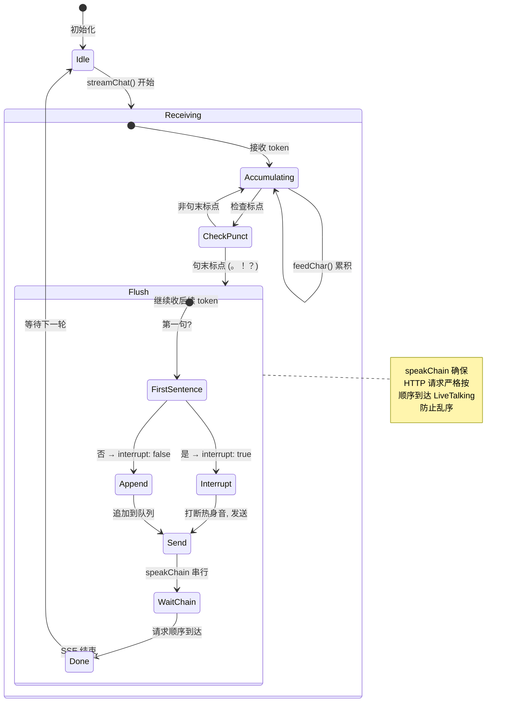

---

## 十、项目代码目录结构映射

```
HealthyDigitalHuman/
├── LiveTalking-main/          # 🎭 数字人引擎 (Python)
│   ├── app.py                 #    主入口
│   ├── config.py              #    参数解析
│   ├── streamout/rtmp.py      #    RTMP 推流 (修复版)
│   ├── tts/sovits.py          #    GPT-SoVITS 适配
│   ├── tts/edge.py            #    EdgeTTS 备选
│   ├── tts/base_tts.py        #    TTS 基类 (msgqueue)
│   ├── server/routes.py       #    API 路由
│   ├── server/subtitle_sync.py #    字幕同步
│   ├── avatars/base_avatar.py  #    渲染循环
│   ├── avatars/wav2lip/       #    口型模型
│   └── data/avatars/1005/     #    数字人形象
│
├── TTS/
│   └── GPT-SoVITS-main/       # 🔊 本地 TTS 服务
│       ├── api_v2.py          #    TTS API (:9880)
│       └── GPT_SoVITS/configs/ #  推理配置
│
├── yhzk-mvp-backend/          # 🔧 NestJS 后端
│   └── src/modules/
│       ├── auth/              #    认证 (微信/短信)
│       ├── user/              #    用户管理
│       ├── onboarding/        #    健康建档
│       ├── chat/              #    对话 (SSE + RAG)
│       ├── digital-human/     #    数字人会话
│       ├── avatar-admin/      #    形象管理
│       ├── advisor/           #    顾问
│       └── notification/      #    通知
│
├── ai-service/                # 🤖 AI 服务 (LangGraph)
│   └── app/
│       ├── main.py            #    FastAPI 入口
│       ├── config.py          #    Agent 注册表
│       ├── api/chat.py        #    SSE 接口
│       ├── graph/             #    LangGraph 节点
│       │   ├── nodes/
│       │   │   ├── orchestrator.py
│       │   │   ├── knowledge_qa.py
│       │   │   └── summarizer.py
│       │   └── state.py
│       ├── llm/factory.py     #    LLM 工厂
│       ├── rag/               #    RAG (禁用)
│       ├── fallback/          #    兜底策略
│       └── schemas/           #    数据模型
│
├── yhzk-demo-h5/              # 📱 H5 前端 (React)
│   └── src/
│       ├── App.tsx            #    主逻辑 (句级流式)
│       ├── services/
│       │   ├── chat.ts        #    SSE 对话
│       │   ├── digitalHuman.ts #  数字人对接
│       │   └── subtitleSync.ts # 字幕同步
│       └── components/
│           ├── DigitalHumanPlayer.tsx
│           ├── Subtitle.tsx
│           └── InputBar.tsx
│
├── deploy/                    # 🚀 部署配置
├── backups/                   # 💾 备份
└── back/                      # 📦 历史备份
```

---

## 十一、关键端口一览

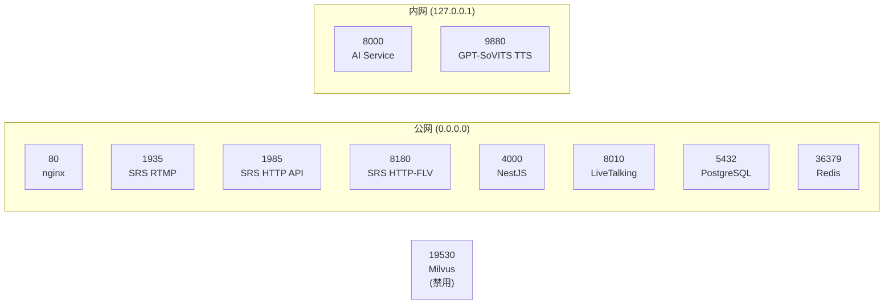

---

## 十二、启动顺序（依赖图）

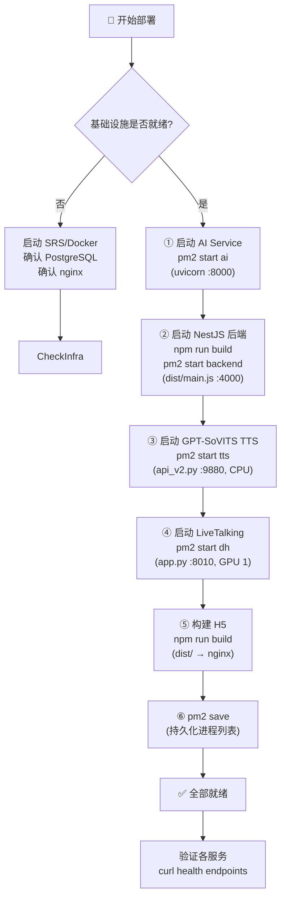

---

## 十三、技术栈总览

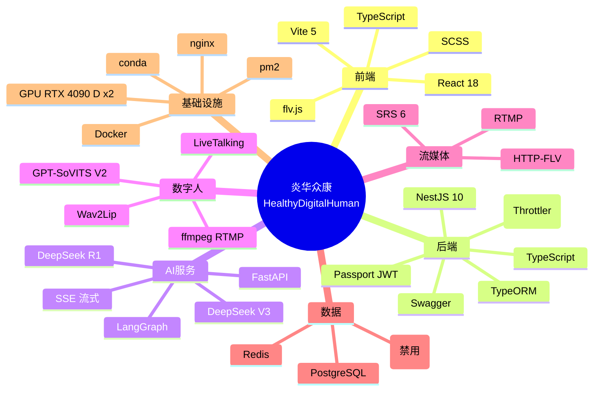
