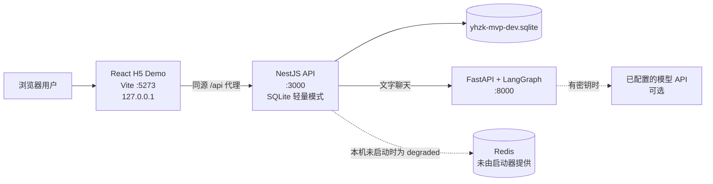
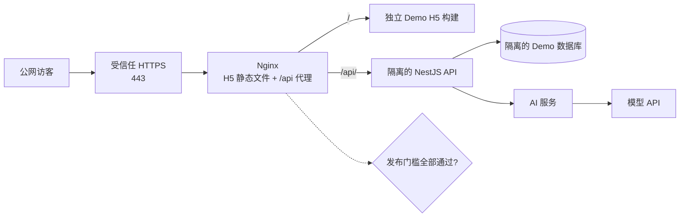
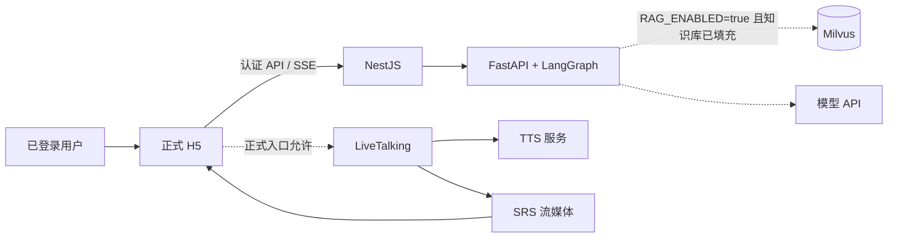

# HealthCompanion 系统架构

更新：2026-09-29。图中本机 Demo 路径对应仓库内 `start-demo.ps1`；公网路径是目标形态，只有通过 HTTPS、隔离部署和聊天验收后才开放。

## 本机匿名文字 Demo

Demo 使用每个浏览器标签独立的临时身份，跳过登录和建档，默认停留在聊天页。Vite、NestJS 与 FastAPI 都只绑定回环地址。启动器没有启动 PostgreSQL 或 Redis，Nest 健康检查将 Milvus 标记为 disabled，因此轻量模式下状态固定为 `degraded`，但健康接口仍返回 HTTP 200。没有模型密钥时，不保证获得模型生成的回答。

## 公网发布目标与门槛

当前检查结果：服务器 Nginx 使用自签名证书；从公网直连 TCP 443 超时；活动 `/api/` 路由指向现有 `:4000` API，配置中没有用 `$remote_addr` 覆盖 `X-Forwarded-For` 的规则；服务器代码版本 `a2be847` 不是这次更新的 Demo 版本。因此公网 Demo 尚未开放。发布前还需要可信 HTTPS、独立的 Demo API/数据存储，并在隔离 API 上只信任一个受控代理跳；不可直接开放当前 API 给匿名 Demo 使用。

## 已登录的正式数字人链路

匿名 Demo 不启用数字人、Xmov、LiveTalking、TTS 或流媒体连接。引用仅在 RAG 开启、Milvus 可用且返回知识片段时产生；默认配置关闭 RAG。完整数字人运行需要外部服务及相应模型文件。
